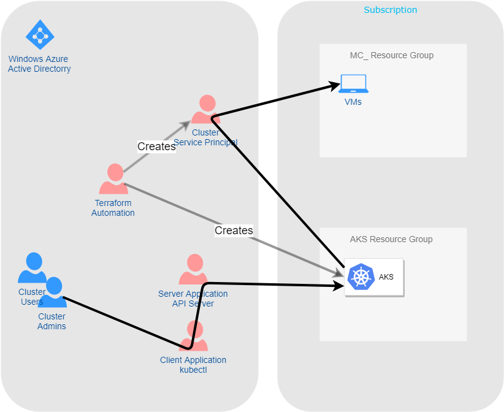

# Basic Concepts

[_Back to overview_](README.md)

## Role Based Access Control

Role-based access control (RBAC) is a method of regulating access to computer or network resources based on the roles of individual users within an enterprise. [See also the Kubernetes Reference](https://kubernetes.io/docs/reference/access-authn-authz/rbac/).

### Azure AAD Integration

The security of AKS clusters can be enhanced with the integration of AAD. In this case Azure is tightly coupled to Azure Active Directory (AAD), which can be used to mange users, groups, roles etc.
This huge user-mangement system can be integrated into kubernetes, so that you can use your Active Directory Principals as Technical Users within Kubernetes and assign them privledges based on namespace, resource-types or based on other metrics.


### Creating the Server and Client Applications

The script below automates the creation and the consenting of the server and client applications used for the AAD integration.

```bash
#!/bin/sh
aksname="<name of the cluster>"

# ============
# Server
# ============

serverApplicationId=$(az ad app create \
    --display-name "${aksname}Server" \
    --identifier-uris "https://${aksname}Server" \
    --query appId -o tsv)

az ad app update --id $serverApplicationId --set groupMembershipClaims=All
az ad sp create --id $serverApplicationId

serverApplicationSecret=$(az ad sp credential reset \
    --name $serverApplicationId \
    --credential-description "AKSPassword" \
    --query password -o tsv)

az ad app permission add \
    --id $serverApplicationId \
    --api 00000003-0000-0000-c000-000000000000 \
    --api-permissions e1fe6dd8-ba31-4d61-89e7-88639da4683d=Scope 06da0dbc-49e2-44d2-8312-53f166ab848a=Scope 7ab1d382-f21e-4acd-a863-ba3e13f7da61=Role

az ad app permission grant --id $serverApplicationId --api 00000003-0000-0000-c000-000000000000
az ad app permission admin-consent --id  $serverApplicationId

# ============
# Client
# ============

clientApplicationId=$(az ad app create \
    --display-name "${aksname}Client" \
    --native-app \
    --reply-urls "https://${aksname}Client" \
    --query appId -o tsv)

az ad sp create --id $clientApplicationId

oAuthPermissionId=$(az ad app show --id $serverApplicationId --query "oauth2Permissions[0].id" -o tsv)

az ad app permission add --id $clientApplicationId --api $serverApplicationId --api-permissions $oAuthPermissionId=Scope
az ad app permission grant --id $clientApplicationId --api $serverApplicationId
```
## The users and principals

The diagram below shows how all the users and principals play together.


## Read further

This [tutorial](https://docs.microsoft.com/de-de/azure/aks/azure-ad-rbac) explains how RBAC with kubernetes actually works.

https://docs.microsoft.com/de-de/azure/aks/operator-best-practices-identity#use-azure-active-directory

https://docs.microsoft.com/de-de/azure/aks/azure-ad-integration
