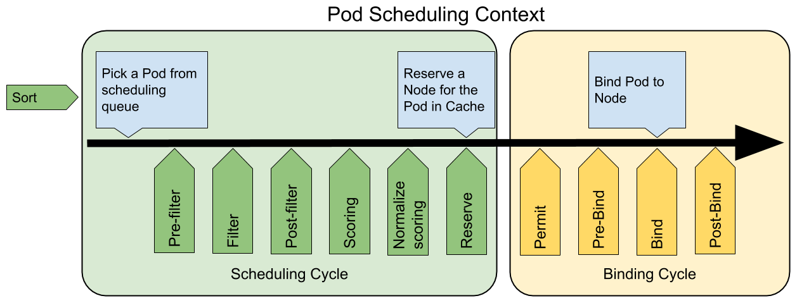

# Scheduling

[_Back to overview_](README.md)

## Scheduling Internals

_In Kubernetes, scheduling refers to making sure that Pods are matched to Nodes so that Kubelet can run them._
(see [Kubernetes Documentation](https://kubernetes.io/docs/concepts/scheduling/kube-scheduler/))

Scheduling is done within the control plane (master-node) of kubernetes.

If you have access to the control plane, there are several extensions points for extending the scheduling behaviour:


## Pod Lifecycle


## Scheduling

Show the labels of your nodes

```bash
kubectl get nodes --show-labels
```

### Node Selector

```yaml
apiVersion: v1
kind: Pod
metadata:
  name: nginx
  labels:
    env: test
spec:
  containers:
    - name: nginx
      image: nginx
      imagePullPolicy: IfNotPresent
  nodeSelector:
    disktype: ssd
```

### Pod Affinity/Anti-Affinity

_Attract pods to certain nodes_

The affinity feature consists of two types of affinity, "node affinity" and "inter-pod affinity/anti-affinity". Node affinity is like the existing nodeSelector, while inter-pod affinity/anti-affinity constrains against pod labels rather than node labels.

#### Node Affinity

```yaml
apiVersion: v1
kind: Pod
metadata:
  name: with-node-affinity
spec:
  affinity:
    nodeAffinity:
      requiredDuringSchedulingIgnoredDuringExecution:
        nodeSelectorTerms:
          - matchExpressions:
              - key: kubernetes.io/e2e-az-name
                operator: In
                values:
                  - e2e-az1
                  - e2e-az2
      preferredDuringSchedulingIgnoredDuringExecution:
        - weight: 1
          preference:
            matchExpressions:
              - key: another-node-label-key
                operator: In
                values:
                  - another-node-label-value
  containers:
    - name: with-node-affinity
      image: k8s.gcr.io/pause:2.0
```

#### Inter-pod affinity and anti-affinity

```yaml
apiVersion: v1
kind: Pod
metadata:
  name: with-pod-affinity
spec:
  affinity:
    podAffinity:
      requiredDuringSchedulingIgnoredDuringExecution:
        - labelSelector:
            matchExpressions:
              - key: security
                operator: In
                values:
                  - S1
          topologyKey: failure-domain.beta.kubernetes.io/zone
    podAntiAffinity:
      preferredDuringSchedulingIgnoredDuringExecution:
        - weight: 100
          podAffinityTerm:
            labelSelector:
              matchExpressions:
                - key: security
                  operator: In
                  values:
                    - S2
            topologyKey: failure-domain.beta.kubernetes.io/zone
  containers:
    - name: with-pod-affinity
      image: k8s.gcr.io/pause:2.0
```

### Taints & Tolerations

_Prevent scheduling of pods on certain nodes_

```yaml
tolerations:
  - key: "key1"
    operator: "Equal"
    value: "value1"
    effect: "NoSchedule"
  - key: "key1"
    operator: "Equal"
    value: "value1"
    effect: "NoExecute"
```

or

```yaml
tolerations:
  - key: "key1"
    operator: "Equal"
    value: "value1"
    effect: "NoExecute"
    tolerationSeconds: 3600
```

## References

https://medium.com/@dominik.tornow/the-kubernetes-scheduler-cd429abac02f
