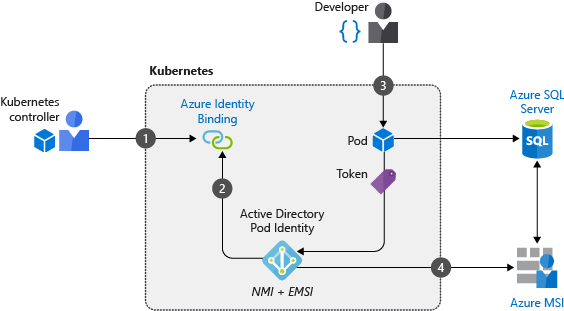

# Authorize pods via Pod Identity

It is generally a best practice to use Azure Active Directory integration with AKS. The suggestion is not to use credential information explicitly like passwords. A further step is to use pod identities where possible. 

## How it works

1. Cluster operator first creates a service account that can be used to map identities when pods request access to services.
2. The NMI server and MIC are deployed to relay any pod requests for access tokens to Azure AD.
3. A developer deploys a pod with a managed identity that requests an access token through the NMI server.
4. The token is returned to the pod and used to access an Azure SQL Server instance.

## Available services

- [Key Vault](https://github.com/Azure/kubernetes-keyvault-flexvol#option-2-pod-identity)
- Cosmos DB
- Blob Storage
- [Application Gateway Kubernetes Ingress](https://github.com/Azure/application-gateway-kubernetes-ingress)

## Further Readings

Github repo for [AAD POD Identity](https://github.com/Azure/aad-pod-identity)
[Auth Best Practices](https://docs.microsoft.com/de-de/azure/aks/operator-best-practices-identity#use-pod-identities)
Using Managed Identities to [Securely Access Azure Resources](https://dzone.com/articles/using-managed-identity-to-securely-access-azure-re)
