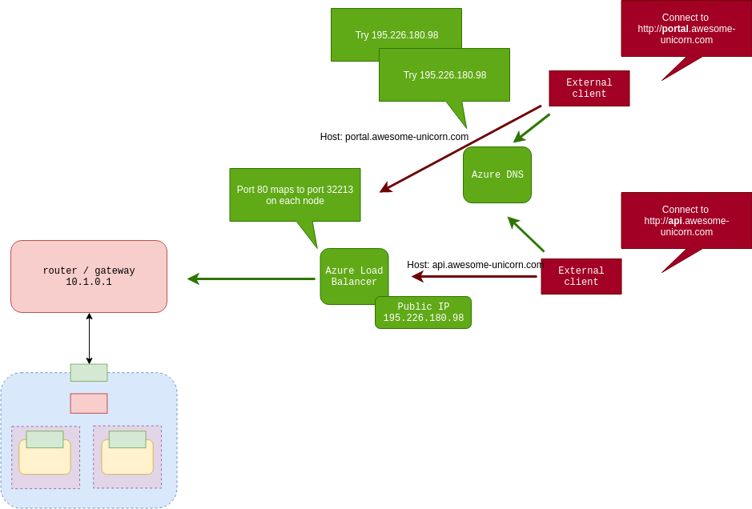
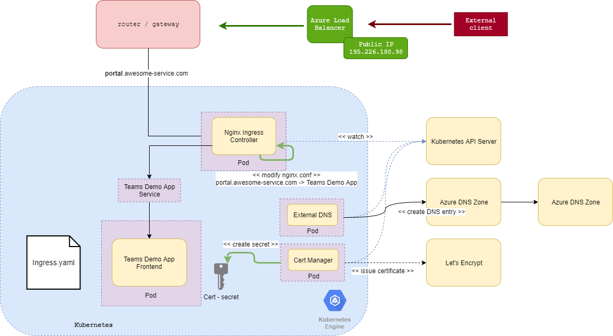

# Networking

[_Back to overview_](README.md)

## Ingress

First, here is an overview of routing traffic from ouside of the cluster:



Now let's take a look at the components handling ingress resources inside the cluster:



## Hands-on

First you have to ensure that you create a DNS-Zone along with your cluster (you can also use an existing one).
This is automatically done when using the terraform templates of this workshop.

Also make sure that all other ingress controllers are removed from the cluster before proceeding further with the steps here.

```bash
helm list
helm delete --purge <your ingress controller release>
kubectl get ingress
kubectl delete ingress <your ingress>
```

Afterwards you have to add the following three components:

1. Ingress Controller
2. External DNS
3. Cert-Manager

```bash

# Add the jetstack helm repository
helm repo add jetstack https://charts.jetstack.io

# Add the ingress-controller to the cluster
helm upgrade --install ingress-controller stable/nginx-ingress --set rbac.create=true --set controller.ingressClass=nginx --set controller.publishService.enabled=true --set serviceAccount.create=true --set controller.extraArgs.v=2

# Add External DNS to the cluster
helm upgrade --install external-dns stable/external-dns --set azure.secretName=azure-config-file --set logLevel=debug --set provider=azure --set rbac.create=true

# Prepare Cert Manager resources (CRDs)
kubectl apply -f https://raw.githubusercontent.com/jetstack/cert-manager/release-0.8/deploy/manifests/00-crds.yaml
kubectl label namespace default certmanager.k8s.io/disable-validation=true --overwrite
helm upgrade --install cert-manager jetstack/cert-manager --set webhook.enabled=false
```

Make sure the following certificates issuers are in place:

```yaml
# resources/issuers/production-issuer.yaml
apiVersion: certmanager.k8s.io/v1alpha1
kind: ClusterIssuer
metadata:
  name: letsencrypt-prod
spec:
  acme:
    # The ACME server URL
    server: https://acme-v02.api.letsencrypt.org/directory
    # Email address used for ACME registration
    email: <your email>
    # Name of a secret used to store the ACME account private key
    privateKeySecretRef:
      name: letsencrypt-prod
    # Enable the HTTP-01 challenge provider
    http01: {}
```

```yaml
# manifests/staging-issuer.yaml
apiVersion: certmanager.k8s.io/v1alpha1
kind: ClusterIssuer
metadata:
  name: letsencrypt-staging
spec:
  acme:
    # The ACME server URL
    server: https://acme-staging-v02.api.letsencrypt.org/directory
    # Email address used for ACME registration
    email: <your email>
    # Name of a secret used to store the ACME account private key
    privateKeySecretRef:
      name: letsencrypt-staging
    # Enable the HTTP-01 challenge provider
    http01: {}
```

Install certificate issuer with `kubectl`:

```bash
kubectl apply -f resources/issuers
```

Now you are ready to install an ingress-definition which will make use of what we've setup before:

```bash
kubectl apply -f resources/example-ingress.yaml
```
