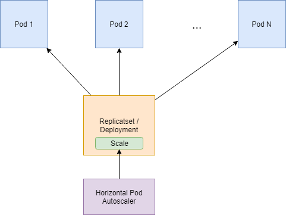

# Horizontal Pod Autoscaling



* Creates or Removes new instances of pods
* Scaling with cluster resources depends on request definition of a pod
* Degree of scaling depends on the degree of utilization (e.g. twice as much as requested => doubles the amount of pods)
* Default Tolerance: 10 %
* If scaling depends on more than one metric the highest calculated pod count will be applied
* Scaling is based on [metrics-server](https://github.com/kubernetes-incubator/metrics-server)
* The `kubectl autoscale`-command will create a `horizontal-pod-autoscaler` (short: `hpa`)


## Example

#### 1. Create a deployment with proper CPU requests

See [this tutorail](../helm/helm-example-application.md) for providing an example application.

Make sure to perform all steps to have resource requests enabled.

#### 2. Create a Horizontal Pod Autoscaler

```
kubectl autoscale deployment backend --namespace=<yournamespace> --min=2 --max=5 --cpu-percent=30`
kubectl get hpa -n <your namespace>
```

#### 3. Generate some load on the pods

```
kubectl get svc
```

`http://<your public ip>/swagger/index.html`

Use the `/api/Load/cpu` endpoint to generate some load.
Duration: 60
Percentage: 90

#### 4. Check the CPU load

(this could take about 20 seconds to be up-to-date)

```
kubectl top pods
kubectl get hpa
```

#### 5. Check if the pod-count has changed

```
kubectl get pods
```

#### 6. Check if downscaling works

After waiting the duration you should see that the CPU load is getting lower again.
Downscaling can take up to 5 Minutes to guarantee a smooth distrubution of the load.

#### 7. Clean Up

```
kubectl delete hpa --namespace <your namespace> backend

For more information see: https://kubernetes.io/docs/tasks/run-application/horizontal-pod-autoscale/