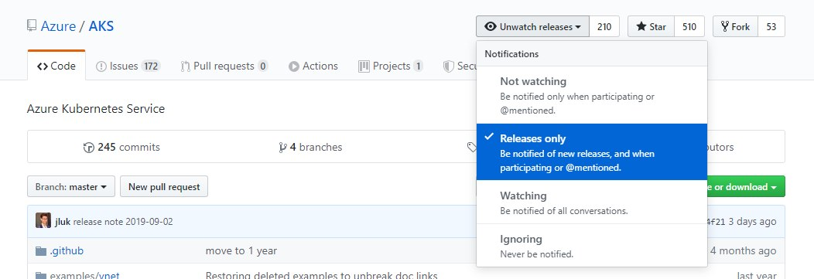

# Azure Kubernetes Service Subtleties

Managed kubernetes from Azure comes with some additional components, which will be described below.

## acs-engine

The base for kubernetes on Azure is aks-engine, which is based on acs-engine:

- https://github.com/Azure/aks-engine
- https://github.com/Azure/aks-engine/tree/master/parts/k8s

## Special System-Pods in AKS deployment

If you look at the default pods in the kube-system namespace you will find some pods that are not listed in the default [system componenents](system-components.md) section:

```bash
> kubectl get pods -n kube-system

azure-cni-networkmonitor-7xk58
...
azure-ip-masq-agent-5lvgq
...
...
coredns-autoscaler-f654c64fd-tjfcb
heapster-6d879b9dc8-mzqwv
kube-proxy-2lbdd
...
kubernetes-dashboard-69bd89c8f7-7nfcz
metrics-server-67c75dbf7-jxnjp
omsagent-2qtrm
...
omsagent-rs-59bdc565b8-5n4rk
tiller-deploy-7b659b7fbd-sr8l5
tunnelfront-bcb7f4d6f-j8w99
```

### azure-cni-networkmonitor

[Github azure-cni-networkmonitor](https://github.com/Azure/azure-container-networking)

Kubernetes CNI Implementation (Container Network Interface) for AKS.

The Azure's CNI network monitor is a service that monitors and fixes any discrepancy in the layer 2 rules that are required to connect containers to Azure's Vnet.

### azure-ip-masq-agent

Networking code from kubelet to controll iptables, CIDRs.

This agent solves the problem of configuring the CIDR ranges for non-masquerade in a cluster (via iptables rules)

[Github ip-masq-agent](https://github.com/kubernetes-incubator/ip-masq-agent)

### coredns

CoreDNS replaces kube-dns. It has a better performance than kube-dns, espacially with managing lots of containers, see [this blog post](https://coredns.io/2018/11/27/cluster-dns-coredns-vs-kube-dns/).

### heapster

Heapster is a performance monitoring and metrics collection system compatible with Kubernetes.
**Depricated** - will be closed in the future. Will be replaced by metrics-server (core-metrics) and prometheus (general monitoring). [Github Heapster](https://github.com/kubernetes-retired/heapster).

### metrics-server

Metrics Server is a cluster-wide aggregator of resource usage data. Runs on a single instance per cluster and aggregates the metrics from kubelet and exposes them to the API server.

### General Monitoring overview in acs-engine (AKS)

See https://github.com/Azure/acs-engine/blob/master/docs/kubernetes/monitoring.md

## The MC\_ resource group

Each AKS deployment spans two resource groups:

You create the first resource group. This group contains only the Kubernetes service resource. The AKS resource provider automatically creates the second resource group during deployment. An example of the second resource group is `MC_myResourceGroup_myAKSCluster_eastus`.

The second resource group, such as `MC_myResourceGroup_myAKSCluster_eastus`, contains all of the infrastructure resources associated with the cluster. These resources include the Kubernetes node VMs, virtual networking, and storage. The purpose of this resource group is to simplify resource cleanup.

Get the name of the MC-group programmatically:

```bash
az aks show --resource-group <resource-group> --name <cluster-name> --query nodeResourceGroup
```

## AKS Upgrades

### OS Updates

Patches are automatically applied to the VMs of the AKS cluster. Some Updates require a reboot of the VMs to apply - **this reboot will not be done automatically**.
If a reboot is required the following file will be created: `/var/run/reboot-required`

#### KURED

You can use [Kured (KUbernetes REboot Deamon) DeamonSet](https://github.com/weaveworks/kured) to automate the reboot step, see: https://docs.microsoft.com/en-us/azure/aks/node-updates-kured

### Cluster Version Upgrades

#### Check for updates manually

```
az aks get-upgrades --resource-group myResourceGroup --name myAKSCluster --output table
```

#### Subscribe to updates

To automtically be notified when new AKS Updates are available, you can subscribe to release-updates the [Azure/AKS on github.com](https://github.com/Azure/AKS):


#### Install an update (this will take a few minutes):

```
az aks upgrade --resource-group myResourceGroup --name myAKSCluster --kubernetes-version 1.13.10
```
